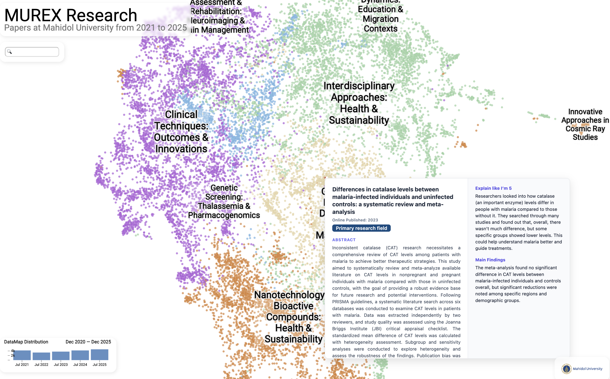
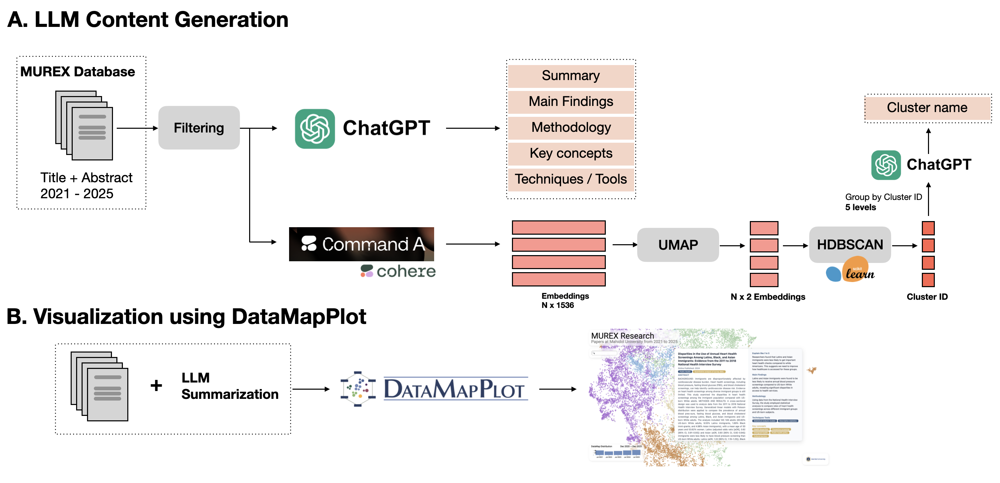

# MUREX Research Map

An interactive visualization exploring the research landscape at Mahidol University from 2021-2025, built using the MUREX (Mahidol University Research EXplorer) database.

[🗺️ Explore the visualization](https://biodatlab.github.io/murex-map) (recommended using Google Chrome on desktop)

### Overview

This project visualizes the evolution and structure of research at Mahidol University over a 5-year period, revealing patterns in interdisciplinary collaboration and emerging research themes at Mahidol University. The visualization employs dimensionality reduction and clustering techniques inspired by [The Illustrated NeurIPS 2025](https://newsletter.languagemodels.co/p/the-illustrated-neurips-2025-a-visual).

### Methodology

Following the approach from the Illustrated NeurIPS visualization blog, we:
- **Generate LLM Content**: Each paper includes AI-generated summaries and contextualization for easier exploration (e.g. techniques, explain like I'm 5, main findings, ...)
- **Embed Research Papers**: Generate [semantic embeddings](https://docs.cohere.com/docs/embeddings) of papers using their titles and abstracts
- **Dimensionality Reduction**: Apply [UMAP](https://github.com/lmcinnes/umap) to project high-dimensional embeddings into 2D space
- **Clustering**: Identify research clusters using [HDBSCAN](https://scikit-learn.org/stable/modules/generated/sklearn.cluster.HDBSCAN.html)
- **Interactive Visualization**: Build an explorable interface using [`datamapplot`](https://datamapplot.readthedocs.io/en/latest/)

